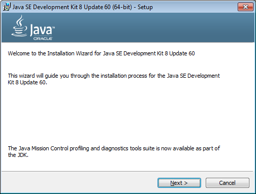
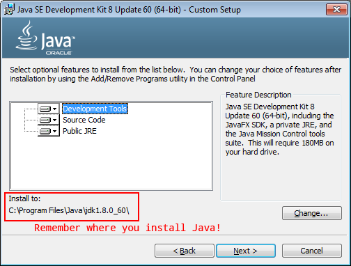
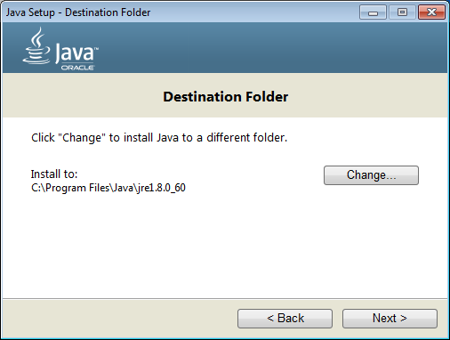
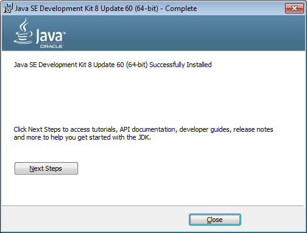

# Installing Java and Maven

There are many tutorials out there on how to install Java and Maven, but we’re going to add another one since they are required for following these tutorials.

## Installing Java

Maven requires Java to be installed so we’ll do that one first. (Note: At the time of this writing, the latest stable release of Java is 1.8.0_60.)

First check if you already have Java installed by opening up a console window (Terminal for OS X or Command Prompt for Windows) and typing `java -version` then pressing enter. If you have Java installed you should see something like this:


```bash
$ java -version

java version "1.8.0_45"
Java(TM) SE Runtime Environment (build 1.8.0_45-b14)
Java HotSpot(TM) 64-Bit Server VM (build 25.45-b02, mixed mode)
```

As long as you have Java 1.7 or higher, that’s fine and you can skip the “Installing Java” section.  If you have Java 1.6 or lower, follow the installation instructions below.

If you *don’t* have Java installed you’ll see an error message:
* Windows users will see a message like: <br>`'Java' is not recognized as an internal or external command, operable program or batch file.`
* OS X users will see a message like:<br> `-bash: Java: command not found`

### Installing Java on Windows

Note: Close ALL command prompts before you install Java.

1. Download Java from [Oracle’s download page](http://www.oracle.com/technetwork/java/javase/downloads/jdk8-downloads-2133151.html) or use the direct links here:

    * [Windows x64 (64-bit)](http://download.oracle.com/otn-pub/java/jdk/8u60-b27/jdk-8u60-windows-x64.exe)
    * [Windows x86 (32-bit)](http://download.oracle.com/otn-pub/java/jdk/8u60-b27/jdk-8u60-windows-i586.exe)

    (If you aren’t sure which version you need, download the 32-bit one.)

2. Once the file has downloaded open it up and follow the installation instructions. (this will install both the JRE and the JDK):<br><br>
    <br><br>
    <br><br>
    <br><br>
    <br>

3. After Java is installed you will need to add Java to your environment variables.

### Installing Java on OS X

Install Java with [Homebrew](http://brew.sh/). (If you don’t have Homebrew installed, you should absolutely install it. Homebrew is a package manager for OS X and keeps your packages consistently organized and versioned.)

Once Homebrew is installed, run the following commands in Terminal:

```bash
brew update
brew tap caskroom/cask
brew install brew-cask
brew cask install java
```

It’s a massive download (over 200MB) so it will take awhile. Once installation is complete, **restart your Mac** to get all the updated settings.

## Installing Maven

But first...

### Short Maven Overview

If you’ve used [NPM](https://www.npmjs.com/) or [Ant+Ivy](http://ant.apache.org/ivy/) or [Gradle](https://gradle.org/) or [NuGet](https://www.nuget.org/) or [Composer](https://getcomposer.org/) then know that Maven is similar to those tools. If you aren’t familiar with any of them then: Welcome to the world of dependency management!

Dependencies are libraries that your project *depends on* to run. For example, the FreeMarker library is a dependency of any webapp that wants to use FreeMarker to render a web page. If I am working on a FreeMarker website with another developer (or even a group of developers), it’s important that we all use the same version of FreeMarker. Without a tool to manage dependencies, we would have to manually keep all our libraries in sync (which is tedious and error-prone.)

Maven ensures developers working on a project together are using the same libraries with the same versions. It handles downloading dependencies and putting them in a consistent location where your Java compiler can find them. It is also used to bundle JAR and WAR files, and can be used to version your own projects.

By default Maven looks for a `pom.xml` file in the root of your project and runs commands based on what is in that file. You can tell Maven to run just about anything. The `pom.xml` file can also be split up into smaller files since xml files tend to become quite verbose.

### Installing Maven on Windows

### Installing Maven on OS X

Install Maven with [Homebrew](http://brew.sh/). (If you don’t have Homebrew installed, you should absolutely install it. Homebrew is a package manager for OS X and keeps your packages consistently organized and versioned.)

Once Homebrew is installed, run the following commands in Terminal:

```bash
brew update
brew install maven
```

Restart your Mac once installation is complete. Open up terminal again and verify your Maven install by running `mvn -v`. You should see something like this:

```bash
$ mvn -v

Apache Maven 3.3.3 (7994120775791599e205a5524ec3e0dfe41d4a06; 2015-04-22T04:57:37-07:00)
Maven home: /usr/local/Cellar/maven/3.3.3/libexec
Java version: 1.8.0_60, vendor: Oracle Corporation
Java home: /Library/Java/JavaVirtualMachines/jdk1.8.0_60.jdk/Contents/Home/jre
Default locale: en_US, platform encoding: UTF-8
OS name: "mac os x", version: "10.10.1", arch: "x86_64", family: "mac"
```
