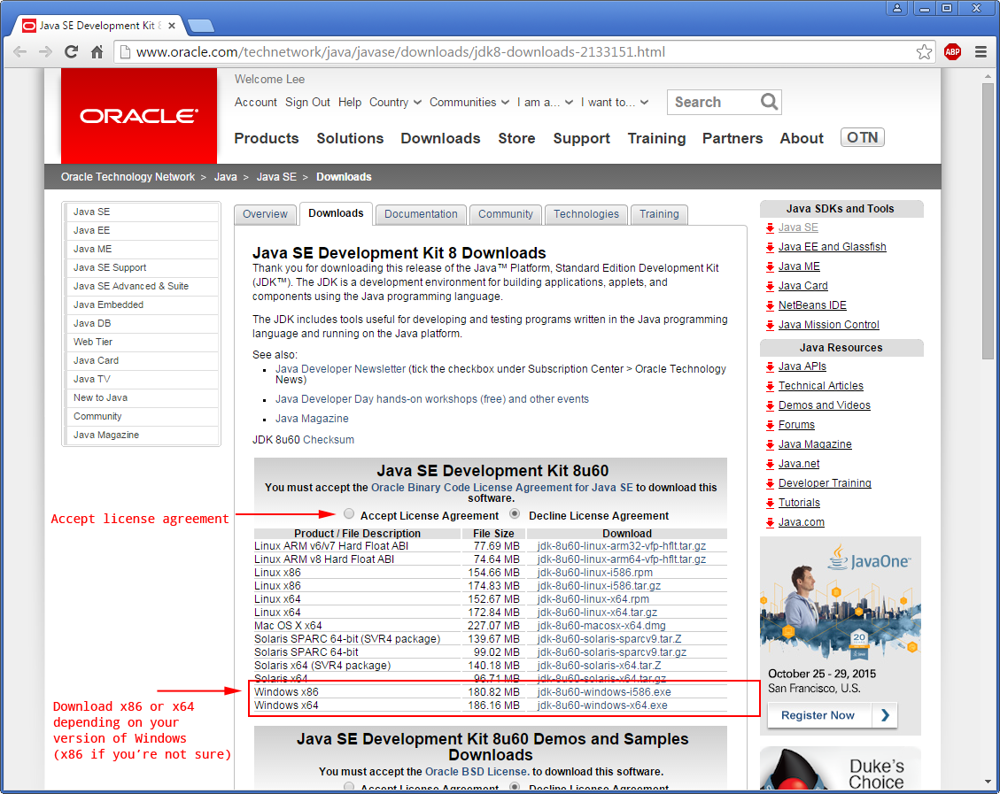
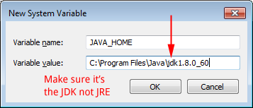
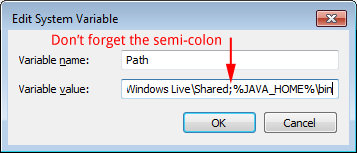
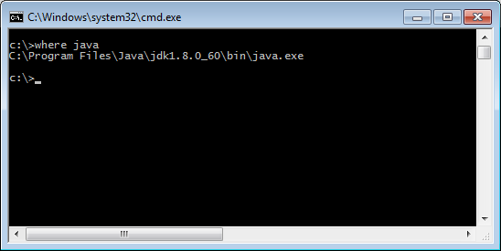
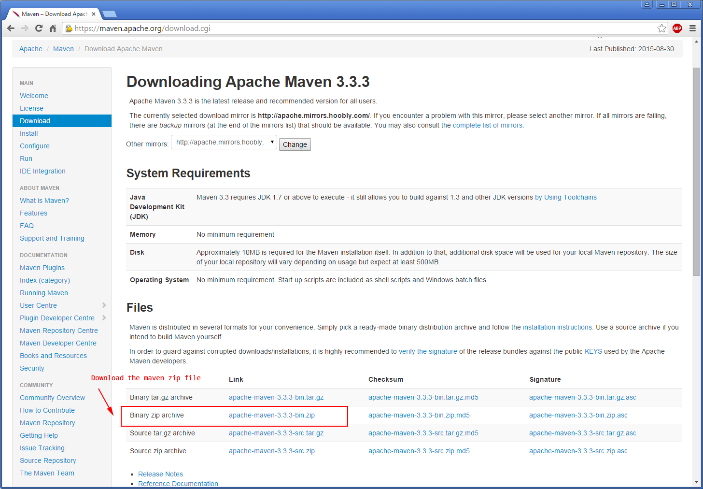
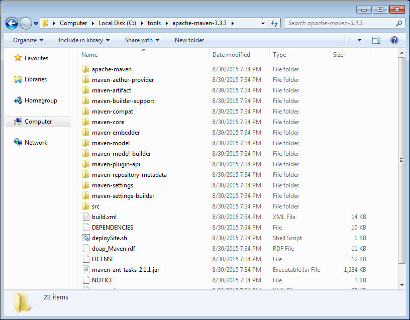
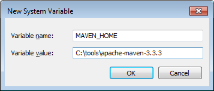
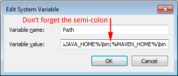
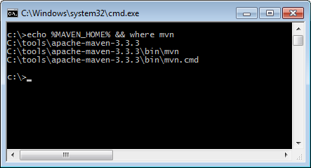

# Installing Java and Maven

Java is required for any FreeMarker development and Maven is commonly used to build FreeMarker webapps. Please make sure you have both Java and Maven installed before you continue on any other tutorials.

## Installing Java

Maven requires Java to be installed so we’ll do that one first. (Note: At the time of this writing, the latest stable release of Java is 1.8.0_60 a.k.a Java 8 update 60)

First check if you already have Java installed by opening up a console window (Terminal for OS X or Command Prompt for Windows) and typing `java -version` then pressing enter.

If you have Java installed you should see something like this:


```bash
$ java -version

java version "1.8.0_60"
Java(TM) SE Runtime Environment (build 1.8.0_60-b27)
Java HotSpot(TM) 64-Bit Server VM (build 25.60-b23, mixed mode)
```

As long as you have Java 1.7 or higher you can skip the “Installing Java” section.

If you *don’t* have Java installed you’ll see an error message:
* Windows users will see a message like:

    ```
    'Java' is not recognized as an internal or external command, operable program or batch file.
    ```
* OS X users will see a message like:

    ```
    -bash: Java: command not found
    ```

### Installing Java on Windows

Note: Close ALL command prompts before you install Java.

1. Download Java from [Oracle’s download page](http://www.oracle.com/technetwork/java/javase/downloads/jdk8-downloads-2133151.html).

    

    (If you aren’t sure which version you need, download the x86 version.)

2. Once the file has downloaded open it up and follow the installation instructions. (This will install both the JRE and the JDK):

    

    

    **Remember where you installed Java JDK because you will need the path in the next step.**

    

    

    After Java is installed you will need to add Java to your environment variables. (Note: Make sure ALL your command prompts are closed before you edit the environment variables)

4. Open up environment variables ([tutorial on how to access your environment variables](../00-updating-environment-variables)) and set JAVA_HOME equal to your **jdk** path

    

5. Next we have to add JAVA_HOME to our path. In environment variables, find the Path variable and edit it:

    

6. At the end of “Variable value” add `;%JAVA_HOME%\bin` (Don’t forget the semi-colon!)

    

7. Click “OK” and “OK” again and “OK” one last time to exit out of environment variables.

8. Open up command prompt and type `echo %JAVA_HOME% && where java` and you should see this:

    

    If you do not see this you may have had a command prompt open while editing your environment variables and you will need restart your computer and try again.

### Installing Java on OS X

1. Install Java with [Homebrew](http://brew.sh/). (If you don’t have Homebrew installed, you should absolutely install it. Homebrew is a package manager for OS X and keeps your packages consistently organized and versioned.)

    Once Homebrew is installed, run the following commands in Terminal:

    ```bash
brew update
brew tap caskroom/cask
brew install brew-cask
brew cask install java
    ```

    It’s a massive download (over 200MB) so it will take awhile.

2. Once installation is complete, **restart your Mac** (or log out and log in) to get all the updated settings.

3. After restarting, open up your bash profile by doing `vi ~/.bash_profile` in Terminal

4. Edit your bash profile so it looks like this: (press `i` to insert text and then press `esc` then `:wq` to save)

    ```bash
    export JAVA_HOME=$(/usr/libexec/java_home)

  PATH=$PATH:$JAVA_HOME
    ```

5. After saving confirm JAVA_HOME is set to the same version as what you installed with Homebrew:

    ```bash
    $ echo $JAVA_HOME

    /Library/Java/JavaVirtualMachines/jdk1.8.0_60.jdk/Contents/Home

    ```

## Installing Maven

(Note: At the time of this writing the latest stable release of Maven is 3.3.3)

First check if you already have Maven installed by opening up a console window (Terminal for OS X or Command Prompt for Windows) and typing `mvn -v`.  

If you have Maven installed you should see something like this:

```bash

$ mvn -v

Apache Maven 3.3.3 (7994120775791599e205a5524ec3e0dfe41d4a06; 2015-04-22T04:57:37-07:00)
Maven home: /usr/local/Cellar/maven/3.3.3/libexec
Java version: 1.8.0_60, vendor: Oracle Corporation
Java home: /Library/Java/JavaVirtualMachines/jdk1.8.0_60.jdk/Contents/Home/jre
Default locale: en_US, platform encoding: UTF-8
OS name: "mac os x", version: "10.10.1", arch: "x86_64", family: "mac"
```

As long as you have Maven 3.1 or higher you can skip the “Installing Maven” section.

If you *don’t* have Maven installed you’ll see an error message:
* Windows users will see a message like:

    ```
    'mvn' is not recognized as an internal or external command, operable program or batch file.
    ```
* OS X users will see a message like:

    ```
    -bash: mvn: command not found
    ```

### Short Maven Overview

If you already know what Maven is you can skip this section.

If you’ve used [NPM](https://www.npmjs.com/) or [Ant+Ivy](http://ant.apache.org/ivy/) or [Gradle](https://gradle.org/) or [NuGet](https://www.nuget.org/) or [Composer](https://getcomposer.org/) then know that Maven is similar to those tools. If you aren’t familiar with any of them then: Welcome to the world of dependency management!

Dependencies are libraries that your project *depends on* to run. For example, the FreeMarker library is a dependency of any webapp that wants to use FreeMarker to render a web page. If I am working on a FreeMarker website with another developer (or even a group of developers), it’s important that we all use the same version of FreeMarker. Without a tool to manage dependencies, we would have to manually keep all our libraries in sync (which is tedious and error-prone.)

Maven ensures developers working on a project together are using the same libraries with the same versions. It handles downloading dependencies and putting them in a consistent location where your Java compiler can find them. It is also used to bundle JAR and WAR files, and can be used to version your own projects.

By default Maven looks for a `pom.xml` file in the root of your project and runs commands based on what is in that file. You can tell Maven to run just about anything. The `pom.xml` file can also be split up into smaller files since xml files tend to become quite verbose.

### Installing Maven on Windows

1. Download Maven from https://maven.apache.org/download.cgi:

    

2. Extract the zip file into some where you will remember, like `C:\tools\apache-maven-3.3.3` (Make sure it’s not `C:\tools\apache-maven-3.3.3\apache-maven-3.3.3`):

    

3. Open up environment variables ([tutorial on how to access your environment variables](../00-updating-environment-variables)) and set MAVEN_HOME equal to the place where you just extracted your zip file:

    

4. Next we have to add JAVA_HOME to our path. In environment variables, find the Path variable and edit it:

    

5. At the end of “Variable value” add `;%MAVEN_HOME%\bin` (Don’t forget the semi-colon!)

    

7. Click “OK” and “OK” again and “OK” one last time to exit out of environment variables.

8. Open up command prompt and type `echo %MAVEN_HOME% && where mvn` and you should see this:

    

    If you do not see this you may have had a command prompt open while editing your environment variables and you will need restart your computer and try again.

### Installing Maven on OS X

1. Install Maven with [Homebrew](http://brew.sh/). (If you don’t have Homebrew installed, you should absolutely install it. Homebrew is a package manager for OS X and keeps your packages consistently organized and versioned.)

    Once Homebrew is installed, run the following commands in Terminal:

    ```bash
    brew update
brew install maven
    ```

2.  Restart your Mac once installation is complete.

3. After restarting, open up Terminal again and verify your Maven install by running `mvn -v`. You should see something like this:

    ```bash
    $ mvn -v

    Apache Maven 3.3.3 (7994120775791599e205a5524ec3e0dfe41d4a06; 2015-04-22T04:57:37-07:00)
    Maven home: /usr/local/Cellar/maven/3.3.3/libexec
    Java version: 1.8.0_60, vendor: Oracle Corporation
    Java home: /Library/Java/JavaVirtualMachines/jdk1.8.0_60.jdk/Contents/Home/jre
    Default locale: en_US, platform encoding: UTF-8
    OS name: "mac os x", version: "10.10.1", arch: "x86_64", family: "mac"
    ```
