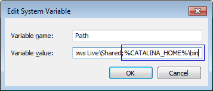

# Setting Up and Running Tomcat

Before you can run your [FreeMarker](http://freemarker.org) webapp, you’ll need to start a server locally. This tutorial will go over a basic [Apache Tomcat](http://tomcat.apache.org/) configuration for your local machine.

## Prerequisites

This tutorial assumes you have some basic knowledge of programming concepts and problem solving skills.

You will also need a computer with admin/root access.

## Disclaimer

This tutorial is simply a guide to get a server up and running for *local development*. This tutorial should **by no means** be used as a reference for setting up an enterprise webapp. This tutorial is not being written from the perspective of a security expert and should not be treated as such. Again: This information is only for the purpose of local development.

Alright. Now that we have that out of the way—let’s move on.

## Why Tomcat?

Many different servers will run JEE webapps and they all have their various pros and cons. I’ve found Tomcat easy to configure and I like how quickly it starts up.

You are more than welcome to use another sever, such as [JBoss](http://www.jboss.org/) or [GlassFish](https://glassfish.java.net/), but all these tutorials will be referencing Tomcat paths.

## Download and Install Tomcat

At the time of this writing, the latest stable version of Tomcat is **8.0.26**.

### Windows Users

Note: Based on Windows 7

1. On the [Tomcat download page](http://tomcat.apache.org/download-80.cgi), under Binary Distributions > Core, download the either the 32-bit or 64-bit Windows zip. (If you aren’t sure if your system is 32-bit or 64-bit, download the 32-bit version.)

2. Extract the zip somewhere you’ll remember, like `C:\tools\apache-tomcat-8.0.26`

3. Create a new environment variable named `CATALINA_HOME` and set it to your Tomcat directory. Then and add `%CATALINA_HOME%\bin` to your PATH. Like so:  
  1. Open up your [Environment Variables](http://www.nextofwindows.com/how-to-addedit-environment-variables-in-windows-7)
  2. Under System variables, click `New`
  3. In `Variable name` write `CATALINA_HOME`  In `Variable value` write `C:\tools\apache-tomcat-8.0.26` (or wherever you extracted your Tomcat folder). It should look something like this:      
  4. Click `OK`
  5. Under System variables, find the PATH variable and click `Edit`
  6. Add `;%CATALINA_HOME%\bin` to the end of the input (Don’t forget the semi-colon!). It should look something like this:    
  7. Click `OK`

4. Open up **Command prompt** (Start > Run > cmd) and type "startup". You should see a console window open.

  * (If you get an error like `'startup' is not recognized as an internal or external command`, log in and out and that should fix it)
  * Note: A notification from Windows firewall may pop up. It’s safe to allow access for private networks.

5. Open your favorite web browser and navigate to [http://localhost:8080/](http://localhost:8080/). You should see something like this:   

### OS X Users

1. If you haven’t already done so, install [Homebrew](http://brew.sh/). Homebrew is similar to [APT](https://en.wikipedia.org/wiki/Advanced_Packaging_Tool) and facilitates easier package management.
2. Install Tomcat with Homebrew (Open up Terminal and type `brew install tomcat`)
3. To start up Tomcat run `catalina start`
4. Open your favorite web browser and navigate to [http://localhost:8080/](http://localhost:8080/). You should see something like this:   

### Linux Users

No access to a Linux box at the moment, but pull requests are welcome :)

## Conclusion

Remember where you installed Tomcat! We will need to update the configuration in the next tutorial.
