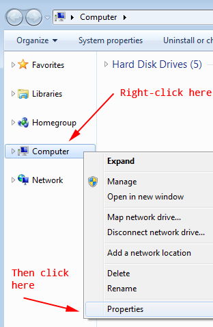
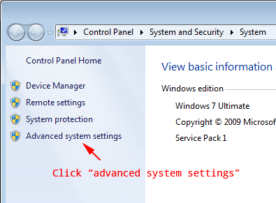
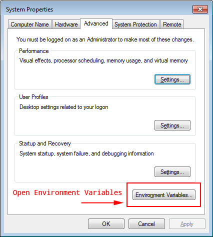
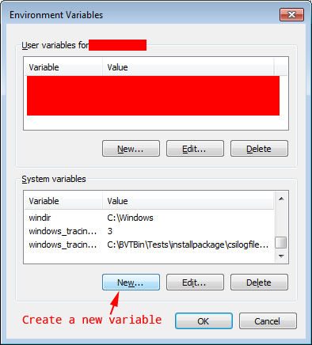
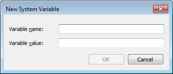

# Updating Environment Variables

Some tutorials will ask you to update your environment variables. Here is how to add a new environment variable.

## Updating Environment Variables for Windows Users

(Based on Windows 7)

**IMPORTANT NOTE:** Make sure **ALL** command prompt windows are CLOSED *before* you edit your environment variables. If you don’t you will not see the updates and will have to restart your computer.

1. Open Windows Explorer and right-click on **Computer** and select **Properties**:

    

2. Next click on **Advanced system settings**

    

3. Then click on **Environment Variables**

    

4. Then click on **New**

    

5. This window should pop up and this is where you add the variable name and value:

    
