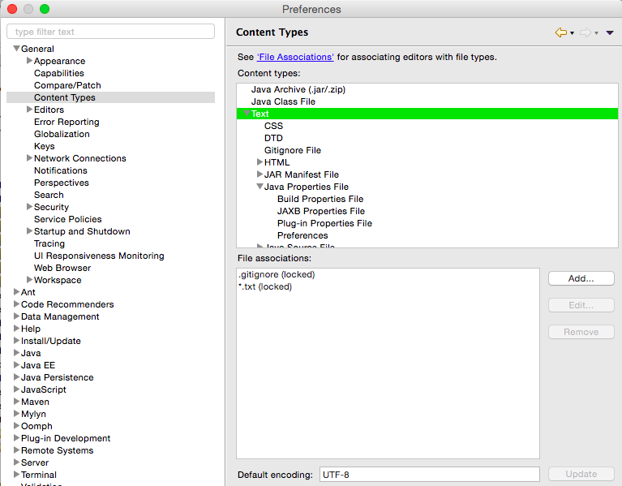
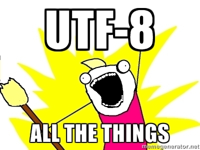

# FreeMarker Hello World

Here we will set up a very basic FreeMarker webapp using [Spring MVC](http://spring.io/).  We will also be using [Java-based Spring configuration](http://docs.spring.io/spring/docs/current/spring-framework-reference/html/beans.html#beans-java). (Legacy Spring MVC apps may still use xml-based Spring configuration, but this is not recommended for new projects.)

This tutorial assumes you have a Tomcat server running locally (or a server you’re comfortable configuring on your own.)

If you aren’t sure how to run Tomcat locally, please review the [Running a server locally](../00-running-a-server-locally) tutorial.

**Libraries Used**

* [FreeMarker 2.3.23](http://freemarker.org/docs/)
* [Spring MVC 4.2](https://spring.io/blog/2015/07/31/spring-framework-4-2-goes-ga)
* Javax Servlet API 3.1.0

## Tutorial notes

This project contains mostly the *minimum* dependencies for a FreeMarker webapp. Other staple dependencies like [log4j](http://logging.apache.org/log4j/2.x/) and [Joda time](http://www.joda.org/joda-time/) will be used in subsequent tutorials.

First we will set up and run the project, then we will go into details on what each file does.

### UTF-8

Everything in this project will be configured using UTF-8 charset. When making a new webapp, it is crucial you set up your project to have consistent UTF-8 file encodings.

If you don’t, you risk your site having embarrassing encoding issues (ever seen a site with words like "don’t" instead of "don’t"? Yeah, awkward.) It’s also a huge pain to go back and fix encoding issues, so just use **UTF-8 for everything from the start**.

Every editor is different and some set different default encodings for different file types. For example if you’re using Eclipse, go through **each file type** and make sure the default encoding is set to UTF-8 for each extension:



## Step 1: Download or clone the FreeMarker Tutorials project

[Download and extract the FreeMarker Tutorials Github project](https://github.com/freemarker/freemarker-tutorials/archive/master.zip) or clone it using git (`git clone https://github.com/freemarker/freemarker-tutorials.git`)

## Step 2: Compile the Hello World project

Open up a console window (Command prompt for Windows users or Terminal for OS X users) and navigate to the `tutorials/01-hello-world` directory. Run `mvn compile war:inplace`.

```bsh
mvn compile war:inplace
```

(If you don’t have Maven, follow the installation instructions here: [Installing Java and Maven](../00-installing-java-and-maven/))

This will download the dependencies and compile the Java files.

## Step 3: Point Tomcat at your webapp directory

1. In the [previous tutorial](../00-running-a-server-locally) we set up a Tomcat server. Make sure your server is still running!

    * Windows users: Open up Command Prompt, type `catalina start` and press enter
    * OS X users: Open up Terminal, type `catalina start` and press enter

2. Navigate to your Tomcat installation folder, and find the `conf/Catalina/localhost` directory and create a context file called **hello-world.xml**.

    * Windows users: If you followed the previous tutorial’s instructions, Windows users can navigate directly to the folder by copying and pasting `%CATALINA_HOME%\conf\Catalina\localhost` into a Windows explorer window.

        

    * OS X users: In Terminal you can do this (Replace **8.0.26** with your version of Tomcat):

        ```bsh
        cd /usr/local/Cellar/tomcat/8.0.26/libexec/conf/Catalina/localhost
        vi hello-world.xml
        ```

3. Inside `hello-world.xml`, add the following (Replace **PATH_TO_FREEMARKER_TUTORIALS** with
    wherever you have the FreeMarker tutorials project.:

    ```xml
    <?xml version="1.0" encoding="utf-8"?>
    <Context docBase="PATH_TO_FREEMARKER_TUTORIALS/01-hello-world/src/main/webapp" path="" reloadable="true" />
    ```

4. You should now be able to access the FreeMarker Hello World webapp at [http://localhost:8080/hello-world/](http://localhost:8080/hello-world/).

    


### A note about context files

It is important to note that the **/hello-world/** part of the URL is **based on the name of the XML file we created**. If we renamed `hello-world.xml` to `banana-bunnies.xml`, then our webapp would be accessible at http://localhost:8080/banana-bunnies/.  If you wanted to deploy the webapp to http://localhost:8080, you would rename the xml file to (case-sensitive) `ROOT.xml`.

Context files are convenient because you can deploy different webapps to the same domain without needing to redeploy the whole domain.

For example, if you had a website with a “Special Offers” section, you could separate it into it’s own webapp and deploy the `special-offers` app without affecting the main website.

* http://example.com - Deloyed using `ROOT.xml`
* http://example.com/special-offers/ - Deployed using `special-offers.xml`

## Step 4: Digging into the files

First, a summary of the files and directories:

```
01-hello-world/
  src/
    java/
      FreeMarkerTutorials/
        config/
          AppConfig.java
          CustomFreeMarkerView.java
          CustomFreeMarkerViewResolver.java
          WebMvcConfig.java
        controller/
          HelloWorld.java
        AppInitializer.java
    main/
      webapp/
        WEB-INF/
          ftl/
            views/
              hello-world.ftl
          web.xml
```

All JEE webapps should follow the `/src/main/java` and `/src/main/webapp` directory structure. (Normally there is another folder named `src/main/resources` but we don’t need that for this example.)

### web.xml

Web.xml ([source](src/main/webapp/WEB-INF/web.xml)) is ([required by Tomcat](http://wiki.metawerx.net/wiki/Web.xml).) We’ll use web.xml in subsequent tutorials. For now the inside of `<web-app></web-app>` can be be empty.


```xml
<web-app xmlns="http://xmlns.jcp.org/xml/ns/javaee"
  xmlns:xsi="http://www.w3.org/2001/XMLSchema-instance"
  xsi:schemaLocation="http://xmlns.jcp.org/xml/ns/javaee
                      http://xmlns.jcp.org/xml/ns/javaee/web-app_3_1.xsd"
  version="3.1"
  metadata-complete="true">
</web-app>
```


### AppInitializer.java

AppInitializer.java ([source](src/main/java/FreeMarkerTutorials/AppInitializer.java)) tells Spring where to look for the webapp configuration. Historically this was handled by a `servlet.xml` file. Pretty standard stuff—not much to see here. (You would have this file for any Spring MVC project)

```java
public class AppInitializer implements WebApplicationInitializer {

    @Override
    public void onStartup(ServletContext servletContext) throws ServletException {
        WebApplicationContext context = getContext();
        servletContext.addListener(new ContextLoaderListener(context));
        ServletRegistration.Dynamic dispatcher = servletContext.addServlet("DispatcherServlet", new DispatcherServlet(context));
        dispatcher.setLoadOnStartup(1);
        dispatcher.addMapping("/");
    }

    private AnnotationConfigWebApplicationContext getContext() {
        AnnotationConfigWebApplicationContext context = new AnnotationConfigWebApplicationContext();
        context.setConfigLocation("FreeMarkerTutorials.config"); // this maps to src/main/java/FreeMarkerTutorials/config/
        return context;
    }
}
```

### AppConfig.java

AppConfig.java ([source](src/main/java/FreeMarkerTutorials/config/AppConfig.java)) is pretty boring. It just tells Spring where to look for the `@Configuration` classes.

```java
@Configuration
@ComponentScan(basePackages = "FreeMarkerTutorials")
public class AppConfig {

}
```

### WebMvcConfig.java

WebMvcConfig.java ([source](src/main/java/FreeMarkerTutorials/config/WebMvcConfig.java))

Relevant code:

```java
@Bean
public CustomFreeMarkerViewResolver freeMarkerViewResolver() {
    CustomFreeMarkerViewResolver resolver = new CustomFreeMarkerViewResolver();
    resolver.setPrefix("/views/");
    resolver.setSuffix(".ftl");
    resolver.setCache(false); // don't disable the cache in production!

    resolver.setContentType("text/html;charset=UTF-8");
    resolver.setRequestContextAttribute("requestContext");

    return resolver;
}

@Bean
public FreeMarkerConfigurer freeMarkerConfigurer(WebApplicationContext applicationContext)
        throws IOException, TemplateException {
    FreeMarkerConfigurer configurer = new FreeMarkerConfigurer();

    configurer.setServletContext(applicationContext.getServletContext());

    freemarker.template.Configuration configuration = configurer.createConfiguration();

    configuration.addAutoInclude("/templates/include-common.ftl");
    configuration.setServletContextForTemplateLoading(applicationContext.getServletContext(), "/WEB-INF/ftl/");
    configuration.setIncompatibleImprovements(freemarker.template.Configuration.VERSION_2_3_23);
    configuration.setTemplateExceptionHandler(TemplateExceptionHandler.HTML_DEBUG_HANDLER); // use this for local development

    configuration.setDefaultEncoding("UTF-8");
    configuration.setOutputEncoding("UTF-8");
    configuration.setURLEscapingCharset("UTF-8");

    configurer.setConfiguration(configuration);

    return configurer;
}

@Bean
SessionLocaleResolver localeResolver() {
    SessionLocaleResolver localeResolver = new SessionLocaleResolver();
    localeResolver.setDefaultLocale(Locale.US);

    return localeResolver;
}
```

#### Explanations for `freeMarkerViewResolver()`

* ```java
resolver.setPrefix("/views/");
resolver.setSuffix(".ftl");
```

    This tells the view resolver to look for files with a `.ftl` file extension in the `/views/` directory.

- - -

```java
resolver.setCache(false); // don't disable the cache in production!
```

By default the view resolver will cache view files. This means that when you edit a FreeMarker file you will not see the changes immediately after refreshing. When you are developing locally it is okay to disable the cache.

- - -

```java
resolver.setContentType("text/html;charset=UTF-8");
```

This ensures the content type is text/html and the charset is UTF-8. This should always be set by the backend.

Note: If you’ve used JSP you may have set the encoding like this in a JSP file:

```jsp
<%@ page contentType="text/html; charset=UTF-8" pageEncoding="UTF-8"%>
```

This is a very poor practice and is unfortunately a recommended approach in many JSP tutorials. This is wrong. Content type and encoding should NEVER, **EVER** be set in the view layer. *Ever*.

By setting it in the view you risk ending up with inconsistent encoding across your webapp. Encoding issues quickly spiral out of control and are costly to fix. It is better to have one source of truth for encodings and let the controller handle changing the content type.

- - -

```java
resolver.setRequestContextAttribute("requestContext");
```

This specifies how the name we will use to access our application’s `requestContext` properties. More on this later.

#### Explanation for `freeMarkerConfigurer(WebApplicationContext applicationContext)`

```java
configuration.addAutoInclude("/templates/include-common.ftl");
```

This tells our FreeMarkerConfigurer to add `/WEB-INF/ftl/templates/include-common.ftl` to every FreeMarker file. It is the same as doing `<@include "/templates/include-common.ftl" />` at the top of every FreeMarker file.

This is useful because it will allow frontend developers to define their own global imports. (This setting is commonly used for defining global layouts or shared macros)

- - -

```java
configuration.setServletContextForTemplateLoading(applicationContext.getServletContext(), "/WEB-INF/ftl/");
```

This allows us to omit the `/WEB-INF/ftl/` from every FreeMarker path we define. For example if we didn’t include this line we would have to change `resolver.setPrefix("/views/");` to `resolver.setPrefix("/WEB-INF/ftl/views/");`

 We’re effectively saying “All our FreeMarker files will always be in this folder”. This also ensures the frontend developers will consistently put all their FreeMarker files in the `ftl` folder.

 - - -

 ```java
 configuration.setIncompatibleImprovements(freemarker.template.Configuration.VERSION_2_3_23);
 ```

 This should always be added for new projects. The FreeMarker documentation [explains it best](http://freemarker.org/docs/pgui_config_incompatible_improvements.html#autoid_44)

 - - -

```java
configuration.setTemplateExceptionHandler(TemplateExceptionHandler.HTML_DEBUG_HANDLER); // use this for local development
```

This setting simply formats the stack trace to a more readable format in a web browser. More information can be found in the [FreeMarker documentation](http://freemarker.org/docs/pgui_config_errorhandling.html).

- - -

```java
configuration.setDefaultEncoding("UTF-8");
configuration.setOutputEncoding("UTF-8");
configuration.setURLEscapingCharset("UTF-8");
```

The explanation for this is simple:



### HelloWorld.java

HelloWorld.java ([source](src/main/java/FreeMarkerTutorials/controller/HelloWorld.java)) is a controller whose job is to send model data to the view based on the request.

Relevant code:

```java
@Controller
public class HelloWorld {

    @RequestMapping("/")
    public String loadExample(Model model) {
        model.addAttribute("pageTitle", "Example Freemarker Page");

        return "hello-world";
    }
}
```

#### Explanations

```java
@RequestMapping("/")
public String loadExample(Model model) {

}
```
This tells the server that when a user navigates to http://localhost:8080/hello-world/ that it should use `loadExample` to resolve the view.

If we changed `@RequestMapping("/")` to `@RequestMapping("/xyz/")`, then `loadExample` would get called when the user navigated to http://localhost:8080/hello-world/xyz/.

- - -
```java
model.addAttribute("pageTitle", "Example Freemarker Page");
```
This adds the attribute `pageTitle` to the model which then gets sent to the view. This can now be used by our FreeMarker template (hello-world.ftl) and we can output the value by writing `${pageTitle}` in hello-world.ftl

- - -
```java
return "hello-world";
```
This tells the view resolver what file to look for based on our FreeMarker configuration settings. If we changed this to say `return "foo-bar";` then the resolver would look for `/WEB-INF/ftl/views/foo-bar.ftl`.

The view resolver knows to look in `/WEB-INF/ftl/views/` because we specified `resolver.setPrefix("/views/");` in our view resolver and `configuration.setServletContextForTemplateLoading(applicationContext.getServletContext(), "/WEB-INF/ftl/");` in our `FreeMarkerConfigurer` in [WebMvcConfig.java](src/main/java/FreeMarkerTutorials/config/WebMvcConfig.java).

Note that we don’t have to specify the file extension because we already specified `resolver.setSuffix(".ftl");` in [WebMvcConfig.java](src/main/java/FreeMarkerTutorials/config/WebMvcConfig.java).

- - -
